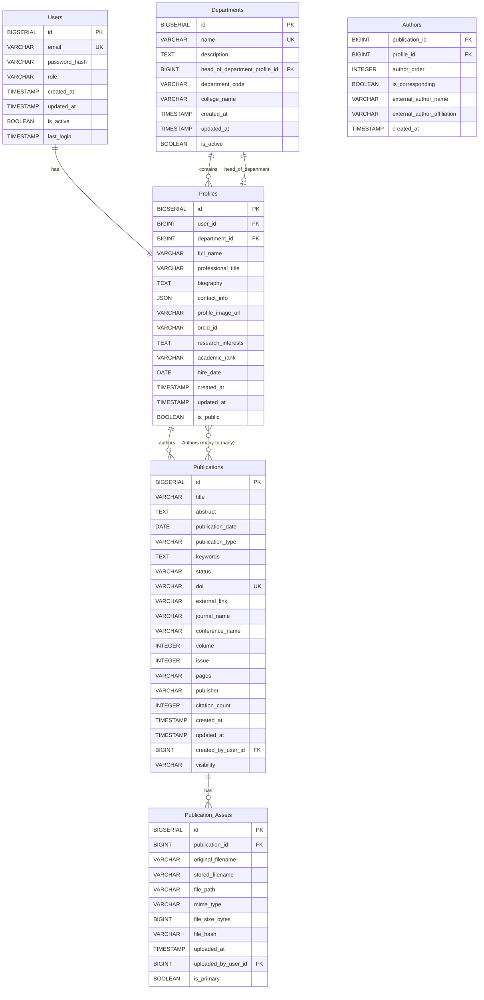

# Data and Information Architecture

## 4. Overview
This document defines the comprehensive data architecture for the University Institutional Academic Repository (UIAR) system, including logical data models, detailed data dictionaries, metadata schemas, and interoperability standards. This architecture serves as the foundation for database design, API development, and integration with external academic systems.

### Related Documentation
- **System Scope**: Data requirements within system boundaries from [System Scope](./01%20SYSTEM_SCOPE.md#121-in-scope-mvp-features)
- **User Requirements**: Data needs based on user personas from [User Types, Personas, and Characteristics](./02%20USER_TYPES_PERSONAS_CHARACTERISTICS.md)
- **Functional Requirements**: Data supporting functional features from [Functional Requirements](./03%20FUNCTIONAL_REQUIREMENTS.md)
- **Security Requirements**: Data protection requirements from [Non-Functional Requirements](./05%20NON_FUNCTIONAL_REQUIREMENTS.md#51-security-requirements)
- **Technical Implementation**: Database technology choices from [System Architecture](./06%20SYSTEM_ARCHITECTURE_TECHNOLOGY_STACK.md#62-technology-stack)
- **Implementation Timeline**: Data model development phases from [Phased Development Roadmap](./07%20PHASED_DEVELOPMENT_ROADMAP.md)

## 4.1. Logical Data Model

### 4.1.1. Core Entity Relationships
The following expanded logical data model builds upon the initial design with enhanced detail about constraints, relationships, and business rules.



### 4.1.2. Extended Entity Definitions

#### 4.1.2.1. Users Table
**Purpose**: Central authentication and authorization management
```sql
CREATE TABLE users (
    id BIGSERIAL PRIMARY KEY,
    email VARCHAR(255) NOT NULL UNIQUE,
    password_hash VARCHAR(255) NOT NULL,
    role VARCHAR(50) NOT NULL CHECK (role IN ('FACULTY', 'ADMIN', 'DEPT_ADMIN')),
    created_at TIMESTAMP NOT NULL DEFAULT CURRENT_TIMESTAMP,
    updated_at TIMESTAMP NOT NULL DEFAULT CURRENT_TIMESTAMP,
    is_active BOOLEAN NOT NULL DEFAULT true,
    last_login TIMESTAMP,
    failed_login_attempts INTEGER DEFAULT 0,
    account_locked_until TIMESTAMP,
    password_reset_token VARCHAR(255),
    password_reset_expires TIMESTAMP,
    email_verified BOOLEAN DEFAULT false,
    email_verification_token VARCHAR(255)
);

CREATE INDEX idx_users_email ON users(email);
CREATE INDEX idx_users_role ON users(role);
CREATE INDEX idx_users_active ON users(is_active);
```

#### 4.1.2.2. Departments Table
**Purpose**: Organizational structure and faculty grouping
```sql
CREATE TABLE departments (
    id BIGSERIAL PRIMARY KEY,
    name VARCHAR(255) NOT NULL UNIQUE,
    description TEXT,
    head_of_department_profile_id BIGINT,
    department_code VARCHAR(20) UNIQUE,
    college_name VARCHAR(255),
    website_url VARCHAR(500),
    contact_email VARCHAR(255),
    contact_phone VARCHAR(50),
    address TEXT,
    created_at TIMESTAMP NOT NULL DEFAULT CURRENT_TIMESTAMP,
    updated_at TIMESTAMP NOT NULL DEFAULT CURRENT_TIMESTAMP,
    is_active BOOLEAN NOT NULL DEFAULT true,
    display_order INTEGER DEFAULT 0
);

CREATE INDEX idx_departments_name ON departments(name);
CREATE INDEX idx_departments_college ON departments(college_name);
CREATE INDEX idx_departments_active ON departments(is_active);
```

#### 4.1.2.3. Profiles Table
**Purpose**: Faculty and researcher professional information
```sql
CREATE TABLE profiles (
    id BIGSERIAL PRIMARY KEY,
    user_id BIGINT NOT NULL REFERENCES users(id) ON DELETE CASCADE,
    department_id BIGINT REFERENCES departments(id) ON DELETE SET NULL,
    full_name VARCHAR(255) NOT NULL,
    professional_title VARCHAR(255),
    biography TEXT,
    contact_info JSONB, -- Flexible storage for various contact methods
    profile_image_url VARCHAR(500),
    orcid_id VARCHAR(50) UNIQUE,
    research_interests TEXT,
    academic_rank VARCHAR(100),
    hire_date DATE,
    office_location VARCHAR(255),
    phone VARCHAR(50),
    website_url VARCHAR(500),
    cv_file_path VARCHAR(500),
    created_at TIMESTAMP NOT NULL DEFAULT CURRENT_TIMESTAMP,
    updated_at TIMESTAMP NOT NULL DEFAULT CURRENT_TIMESTAMP,
    is_public BOOLEAN NOT NULL DEFAULT true,
    profile_views INTEGER DEFAULT 0
);

CREATE UNIQUE INDEX idx_profiles_user_id ON profiles(user_id);
CREATE INDEX idx_profiles_department ON profiles(department_id);
CREATE INDEX idx_profiles_orcid ON profiles(orcid_id);
CREATE INDEX idx_profiles_public ON profiles(is_public);
CREATE INDEX idx_profiles_name ON profiles(full_name);
```

#### 4.1.2.4. Publications Table
**Purpose**: Academic works and research output management
```sql
CREATE TABLE publications (
    id BIGSERIAL PRIMARY KEY,
    title TEXT NOT NULL,
    abstract TEXT,
    publication_date DATE,
    publication_type VARCHAR(100) NOT NULL,
    keywords TEXT,
    status VARCHAR(50) NOT NULL DEFAULT 'DRAFT' 
        CHECK (status IN ('DRAFT', 'UNDER_REVIEW', 'PUBLISHED', 'ARCHIVED')),
    doi VARCHAR(255) UNIQUE,
    external_link VARCHAR(1000),
    journal_name VARCHAR(500),
    conference_name VARCHAR(500),
    volume INTEGER,
    issue INTEGER,
    pages VARCHAR(50),
    publisher VARCHAR(500),
    citation_count INTEGER DEFAULT 0,
    download_count INTEGER DEFAULT 0,
    view_count INTEGER DEFAULT 0,
    created_at TIMESTAMP NOT NULL DEFAULT CURRENT_TIMESTAMP,
    updated_at TIMESTAMP NOT NULL DEFAULT CURRENT_TIMESTAMP,
    created_by_user_id BIGINT NOT NULL REFERENCES users(id),
    visibility VARCHAR(50) NOT NULL DEFAULT 'PUBLIC' 
        CHECK (visibility IN ('PUBLIC', 'INSTITUTIONAL', 'PRIVATE')),
    featured_until TIMESTAMP,
    is_featured BOOLEAN DEFAULT false,
    language_code VARCHAR(10) DEFAULT 'en',
    isbn VARCHAR(20),
    issn VARCHAR(20)
);

CREATE INDEX idx_publications_status ON publications(status);
CREATE INDEX idx_publications_type ON publications(publication_type);
CREATE INDEX idx_publications_date ON publications(publication_date);
CREATE INDEX idx_publications_doi ON publications(doi);
CREATE INDEX idx_publications_visibility ON publications(visibility);
CREATE INDEX idx_publications_featured ON publications(is_featured);
CREATE INDEX idx_publications_created_by ON publications(created_by_user_id);
-- Full-text search index
CREATE INDEX idx_publications_search ON publications USING gin(
    to_tsvector('english', title || ' ' || COALESCE(abstract, '') || ' ' || COALESCE(keywords, ''))
);
```

#### 4.1.2.5. Publication_Assets Table
**Purpose**: File management and digital asset storage
```sql
CREATE TABLE publication_assets (
    id BIGSERIAL PRIMARY KEY,
    publication_id BIGINT NOT NULL REFERENCES publications(id) ON DELETE CASCADE,
    original_filename VARCHAR(500) NOT NULL,
    stored_filename VARCHAR(255) NOT NULL UNIQUE, -- UUID-based filename
    file_path VARCHAR(1000) NOT NULL,
    mime_type VARCHAR(100) NOT NULL,
    file_size_bytes BIGINT NOT NULL,
    file_hash VARCHAR(255) NOT NULL, -- SHA-256 hash for integrity
    uploaded_at TIMESTAMP NOT NULL DEFAULT CURRENT_TIMESTAMP,
    uploaded_by_user_id BIGINT NOT NULL REFERENCES users(id),
    is_primary BOOLEAN NOT NULL DEFAULT false,
    download_count INTEGER DEFAULT 0,
    virus_scan_status VARCHAR(50) DEFAULT 'PENDING',
    virus_scan_date TIMESTAMP,
    file_description TEXT,
    access_level VARCHAR(50) DEFAULT 'PUBLIC'
);

CREATE INDEX idx_assets_publication ON publication_assets(publication_id);
CREATE INDEX idx_assets_stored_filename ON publication_assets(stored_filename);
CREATE INDEX idx_assets_mime_type ON publication_assets(mime_type);
CREATE INDEX idx_assets_primary ON publication_assets(is_primary);
CREATE INDEX idx_assets_uploaded_by ON publication_assets(uploaded_by_user_id);
```

#### 4.1.2.6. Authors Junction Table
**Purpose**: Many-to-many relationship between publications and authors
```sql
CREATE TABLE authors (
    publication_id BIGINT NOT NULL REFERENCES publications(id) ON DELETE CASCADE,
    profile_id BIGINT REFERENCES profiles(id) ON DELETE SET NULL,
    author_order INTEGER NOT NULL,
    is_corresponding BOOLEAN NOT NULL DEFAULT false,
    external_author_name VARCHAR(255), -- For authors not in the system
    external_author_affiliation VARCHAR(500),
    external_author_email VARCHAR(255),
    external_author_orcid VARCHAR(50),
    created_at TIMESTAMP NOT NULL DEFAULT CURRENT_TIMESTAMP,
    PRIMARY KEY (publication_id, author_order),
    CONSTRAINT authors_internal_or_external CHECK (
        (profile_id IS NOT NULL AND external_author_name IS NULL) OR
        (profile_id IS NULL AND external_author_name IS NOT NULL)
    )
);

CREATE INDEX idx_authors_profile ON authors(profile_id);
CREATE INDEX idx_authors_publication ON authors(publication_id);
CREATE INDEX idx_authors_corresponding ON authors(is_corresponding);
```

## 4.2. Detailed Data Dictionary

This comprehensive data dictionary serves as the "single source of truth" for the database schema, eliminating ambiguity between frontend and backend developers regarding data types, validation rules, and nullability.

| Table | Field Name | Data Type | Constraints | Default Value | Description | Validation Rules |
|-------|------------|-----------|-------------|---------------|-------------|------------------|
| **Users** | | | | | | |
| | id | BIGSERIAL | PRIMARY KEY | AUTO | Unique identifier for the user | N/A |
| | email | VARCHAR(255) | NOT NULL, UNIQUE | N/A | Login and contact email | Valid email format, lowercase |
| | password_hash | VARCHAR(255) | NOT NULL | N/A | BCrypt hash of the password | Min 60 chars (BCrypt output) |
| | role | VARCHAR(50) | NOT NULL, CHECK | 'FACULTY' | User's role in the system | FACULTY, ADMIN, DEPT_ADMIN |
| | created_at | TIMESTAMP | NOT NULL | CURRENT_TIMESTAMP | Account creation timestamp | ISO 8601 format |
| | updated_at | TIMESTAMP | NOT NULL | CURRENT_TIMESTAMP | Last update timestamp | ISO 8601 format |
| | is_active | BOOLEAN | NOT NULL | true | Account active status | true/false |
| | last_login | TIMESTAMP | NULL | NULL | Last successful login | ISO 8601 format |
| | failed_login_attempts | INTEGER | NOT NULL | 0 | Count of failed login attempts | 0-10 range |
| | account_locked_until | TIMESTAMP | NULL | NULL | Account lockout expiration | ISO 8601 format |
| **Departments** | | | | | | |
| | id | BIGSERIAL | PRIMARY KEY | AUTO | Unique identifier for the department | N/A |
| | name | VARCHAR(255) | NOT NULL, UNIQUE | N/A | Department full name | 3-255 characters |
| | description | TEXT | NULL | NULL | Department description | Max 5000 characters |
| | head_of_department_profile_id | BIGINT | FK to Profiles | NULL | Current department head | Valid profile ID |
| | department_code | VARCHAR(20) | UNIQUE | NULL | Short department code | 2-20 alphanumeric |
| | college_name | VARCHAR(255) | NULL | NULL | Parent college/school name | 3-255 characters |
| | website_url | VARCHAR(500) | NULL | NULL | Department website URL | Valid URL format |
| | contact_email | VARCHAR(255) | NULL | NULL | Department contact email | Valid email format |
| | is_active | BOOLEAN | NOT NULL | true | Department active status | true/false |
| **Profiles** | | | | | | |
| | id | BIGSERIAL | PRIMARY KEY | AUTO | Unique identifier for the profile | N/A |
| | user_id | BIGINT | NOT NULL, FK to Users | N/A | Associated user account | Valid user ID |
| | department_id | BIGINT | FK to Departments | NULL | Faculty department affiliation | Valid department ID |
| | full_name | VARCHAR(255) | NOT NULL | N/A | Faculty member's full name | 2-255 characters |
| | professional_title | VARCHAR(255) | NULL | NULL | Academic/professional title | Max 255 characters |
| | biography | TEXT | NULL | NULL | Professional biography | Max 10000 characters |
| | contact_info | JSONB | NULL | NULL | Flexible contact information | Valid JSON structure |
| | profile_image_url | VARCHAR(500) | NULL | NULL | Profile photo URL | Valid URL format |
| | orcid_id | VARCHAR(50) | UNIQUE | NULL | ORCID identifier | Valid ORCID format |
| | research_interests | TEXT | NULL | NULL | Research areas and interests | Max 5000 characters |
| | academic_rank | VARCHAR(100) | NULL | NULL | Academic rank/position | Predefined list |
| | hire_date | DATE | NULL | NULL | Faculty hire date | Valid date format |
| | is_public | BOOLEAN | NOT NULL | true | Profile visibility status | true/false |
| **Publications** | | | | | | |
| | id | BIGSERIAL | PRIMARY KEY | AUTO | Unique identifier for the publication | N/A |
| | title | TEXT | NOT NULL | N/A | Publication title | 5-1000 characters |
| | abstract | TEXT | NULL | NULL | Publication abstract | Max 10000 characters |
| | publication_date | DATE | NULL | NULL | Date of publication | Valid date, not future |
| | publication_type | VARCHAR(100) | NOT NULL | N/A | Type of publication | Predefined list |
| | keywords | TEXT | NULL | NULL | Publication keywords/tags | Comma-separated, max 1000 chars |
| | status | VARCHAR(50) | NOT NULL, CHECK | 'DRAFT' | Publication workflow status | DRAFT, UNDER_REVIEW, PUBLISHED, ARCHIVED |
| | doi | VARCHAR(255) | UNIQUE | NULL | Digital Object Identifier | Valid DOI format |
| | external_link | VARCHAR(1000) | NULL | NULL | External publication URL | Valid URL format |
| | journal_name | VARCHAR(500) | NULL | NULL | Journal name | Max 500 characters |
| | conference_name | VARCHAR(500) | NULL | NULL | Conference name | Max 500 characters |
| | volume | INTEGER | NULL | NULL | Journal volume | Positive integer |
| | issue | INTEGER | NULL | NULL | Journal issue | Positive integer |
| | pages | VARCHAR(50) | NULL | NULL | Page numbers | Format: "123-145" or "123" |
| | publisher | VARCHAR(500) | NULL | NULL | Publisher name | Max 500 characters |
| | citation_count | INTEGER | NOT NULL | 0 | Number of citations | Non-negative integer |
| | download_count | INTEGER | NOT NULL | 0 | Download statistics | Non-negative integer |
| | view_count | INTEGER | NOT NULL | 0 | View statistics | Non-negative integer |
| | created_by_user_id | BIGINT | NOT NULL, FK to Users | N/A | User who created the record | Valid user ID |
| | visibility | VARCHAR(50) | NOT NULL, CHECK | 'PUBLIC' | Publication visibility | PUBLIC, INSTITUTIONAL, PRIVATE |
| | is_featured | BOOLEAN | NOT NULL | false | Featured publication flag | true/false |
| | language_code | VARCHAR(10) | NOT NULL | 'en' | Publication language | ISO 639-1 code |
| **Publication_Assets** | | | | | | |
| | id | BIGSERIAL | PRIMARY KEY | AUTO | Unique identifier for the asset | N/A |
| | publication_id | BIGINT | NOT NULL, FK to Publications | N/A | Associated publication | Valid publication ID |
| | original_filename | VARCHAR(500) | NOT NULL | N/A | Original uploaded filename | 1-500 characters |
| | stored_filename | VARCHAR(255) | NOT NULL, UNIQUE | N/A | System-generated filename | UUID format |
| | file_path | VARCHAR(1000) | NOT NULL | N/A | File storage path | Valid system path |
| | mime_type | VARCHAR(100) | NOT NULL | N/A | File MIME type | Whitelisted MIME types |
| | file_size_bytes | BIGINT | NOT NULL | N/A | File size in bytes | Positive integer, max 10MB |
| | file_hash | VARCHAR(255) | NOT NULL | N/A | SHA-256 file hash | 64-character hex string |
| | uploaded_by_user_id | BIGINT | NOT NULL, FK to Users | N/A | User who uploaded the file | Valid user ID |
| | is_primary | BOOLEAN | NOT NULL | false | Primary file flag | true/false |
| | download_count | INTEGER | NOT NULL | 0 | Download statistics | Non-negative integer |
| | virus_scan_status | VARCHAR(50) | NOT NULL | 'PENDING' | Antivirus scan status | PENDING, CLEAN, INFECTED |
| **Authors** | | | | | | |
| | publication_id | BIGINT | NOT NULL, FK to Publications | N/A | Associated publication | Valid publication ID |
| | profile_id | BIGINT | FK to Profiles | NULL | Internal author profile | Valid profile ID |
| | author_order | INTEGER | NOT NULL | N/A | Author order in publication | Positive integer |
| | is_corresponding | BOOLEAN | NOT NULL | false | Corresponding author flag | true/false |
| | external_author_name | VARCHAR(255) | NULL | NULL | External author name | 2-255 characters |
| | external_author_affiliation | VARCHAR(500) | NULL | NULL | External author affiliation | Max 500 characters |
| | external_author_email | VARCHAR(255) | NULL | NULL | External author email | Valid email format |
| | external_author_orcid | VARCHAR(50) | NULL | NULL | External author ORCID | Valid ORCID format |

## 4.3. Metadata Schema and Interoperability

### 4.3.1. Dublin Core Metadata Implementation
To ensure the repository's content is discoverable and interoperable with the global academic ecosystem, all public-facing publication pages must embed metadata compliant with the Dublin Core Metadata Element Set (DCMES). This strategic use of metadata standards directly supports the visibility objective by making content machine-readable and harvestable by external services like OAI-PMH aggregators.

#### 4.3.1.1. Dublin Core Mapping
| Dublin Core Element | Database Field(s) | Implementation Notes |
|-------------------|------------------|---------------------|
| dc.title | Publications.title | Direct mapping, HTML-encoded |
| dc.creator | Profiles.full_name (all co-authors) | Multiple creator elements for co-authors |
| dc.subject | Publications.keywords | Comma-separated keywords as individual subjects |
| dc.description | Publications.abstract | Full abstract text, HTML-encoded |
| dc.publisher | Static: University Name | Configurable university name |
| dc.date | Publications.publication_date | ISO 8601 format (YYYY-MM-DD) |
| dc.type | Publications.publication_type | Mapped to Dublin Core type vocabulary |
| dc.identifier | Publications.doi OR publication URL | Prefer DOI, fallback to local URL |
| dc.language | Publications.language_code | ISO 639-1 language code |
| dc.rights | Static: License/Rights Statement | Configurable rights statement |

#### 4.3.1.2. HTML Meta Tag Implementation
```html
<!-- Example HTML meta tags for a publication page -->
<meta name="DC.title" content="{{publication.title}}" />
<meta name="DC.creator" content="{{author.fullName}}" />
<!-- Multiple creator tags for co-authors -->
<meta name="DC.subject" content="{{keyword}}" />
<!-- Multiple subject tags for keywords -->
<meta name="DC.description" content="{{publication.abstract}}" />
<meta name="DC.publisher" content="{{universityName}}" />
<meta name="DC.date" content="{{publication.publicationDate}}" />
<meta name="DC.type" content="{{mappedPublicationType}}" />
<meta name="DC.identifier" content="https://doi.org/{{publication.doi}}" />
<meta name="DC.language" content="{{publication.languageCode}}" />
<meta name="DC.rights" content="{{institutionalRightsStatement}}" />
```

#### 4.3.1.3. Publication Type Mapping
```java
public enum PublicationType {
    JOURNAL_ARTICLE("Text", "Journal Article"),
    CONFERENCE_PAPER("Text", "Conference Paper"),
    BOOK_CHAPTER("Text", "Book Chapter"),
    BOOK("Text", "Book"),
    THESIS("Text", "Thesis"),
    TECHNICAL_REPORT("Text", "Technical Report"),
    WORKING_PAPER("Text", "Working Paper"),
    DATASET("Dataset", "Research Dataset"),
    SOFTWARE("Software", "Research Software");
    
    private final String dublinCoreType;
    private final String displayName;
}
```

### 4.3.2. Schema.org Structured Data
In addition to Dublin Core, implement Schema.org structured data for enhanced search engine optimization and academic indexing.

```json
{
  "@context": "https://schema.org",
  "@type": "ScholarlyArticle",
  "headline": "{{publication.title}}",
  "author": [
    {
      "@type": "Person",
      "name": "{{author.fullName}}",
      "affiliation": {
        "@type": "Organization",
        "name": "{{author.department.name}}"
      },
      "identifier": "{{author.orcidId}}"
    }
  ],
  "datePublished": "{{publication.publicationDate}}",
  "description": "{{publication.abstract}}",
  "keywords": "{{publication.keywords}}",
  "publisher": {
    "@type": "Organization",
    "name": "{{universityName}}"
  },
  "identifier": {
    "@type": "PropertyValue",
    "propertyID": "DOI",
    "value": "{{publication.doi}}"
  },
  "url": "{{publicationUrl}}",
  "inLanguage": "{{publication.languageCode}}"
}
```

### 4.3.3. OAI-PMH Integration Preparation
```xml
<!-- OAI-PMH Dublin Core record structure -->
<oai_dc:dc xmlns:oai_dc="http://www.openarchives.org/OAI/2.0/oai_dc/"
           xmlns:dc="http://purl.org/dc/elements/1.1/">
  <dc:title>{{publication.title}}</dc:title>
  <dc:creator>{{author.fullName}}</dc:creator>
  <dc:subject>{{keyword}}</dc:subject>
  <dc:description>{{publication.abstract}}</dc:description>
  <dc:publisher>{{universityName}}</dc:publisher>
  <dc:date>{{publication.publicationDate}}</dc:date>
  <dc:type>{{publication.publicationType}}</dc:type>
  <dc:identifier>{{publication.doi}}</dc:identifier>
  <dc:language>{{publication.languageCode}}</dc:language>
  <dc:rights>{{rightsStatement}}</dc:rights>
</oai_dc:dc>
```

## 4.4. Persistent Identifiers: Digital Object Identifier (DOI) Strategy

### 4.4.1. DOI Management Principles
The system must treat DOIs as a primary identifier for scholarly works, following these core principles:

1. **DOI as Primary Identifier**: DOIs serve as the authoritative identifier for published works
2. **Consumer, Not Producer**: The system will consume and link to existing DOIs but will not mint new DOIs
3. **Persistent URLs**: All DOIs must be rendered as resolvable URLs following best practices
4. **Validation and Verification**: DOI format validation and optional resolution verification

### 4.4.2. DOI Implementation Specifications

#### 4.4.2.1. DOI Storage and Validation
```java
@Entity
public class Publication {
    @Column(name = "doi", unique = true, length = 255)
    @Pattern(regexp = "^10\\.\\d{4,}/.+$", message = "Invalid DOI format")
    private String doi;
    
    @Transient
    public String getDoiUrl() {
        return doi != null ? "https://doi.org/" + doi : null;
    }
    
    @Transient
    public boolean hasValidDoi() {
        return doi != null && doi.matches("^10\\.\\d{4,}/.+$");
    }
}
```

#### 4.4.2.2. DOI Validation Service
```java
@Service
public class DoiValidationService {
    
    private static final String DOI_PATTERN = "^10\\.\\d{4,}/.+$";
    private static final String DOI_URL_PREFIX = "https://doi.org/";
    
    public boolean isValidDoiFormat(String doi) {
        return doi != null && doi.matches(DOI_PATTERN);
    }
    
    public String formatDoiUrl(String doi) {
        if (!isValidDoiFormat(doi)) {
            throw new IllegalArgumentException("Invalid DOI format: " + doi);
        }
        return DOI_URL_PREFIX + doi;
    }
    
    @Async
    public CompletableFuture<Boolean> verifyDoiResolution(String doi) {
        try {
            String doiUrl = formatDoiUrl(doi);
            HttpURLConnection connection = (HttpURLConnection) 
                new URL(doiUrl).openConnection();
            connection.setRequestMethod("HEAD");
            connection.setConnectTimeout(5000);
            connection.setReadTimeout(5000);
            
            int responseCode = connection.getResponseCode();
            return CompletableFuture.completedFuture(
                responseCode >= 200 && responseCode < 400
            );
        } catch (Exception e) {
            return CompletableFuture.completedFuture(false);
        }
    }
}
```

#### 4.4.2.3. DOI Display and Linking
```html
<!-- DOI display template -->
<div class="publication-identifiers">
    {{#if publication.doi}}
    <div class="doi-section">
        <span class="identifier-label">DOI:</span>
        <a href="https://doi.org/{{publication.doi}}" 
           target="_blank" 
           rel="noopener noreferrer"
           class="doi-link">
            {{publication.doi}}
            <i class="external-link-icon" aria-hidden="true"></i>
        </a>
    </div>
    {{/if}}
</div>
```

### 4.4.3. DOI Integration with Citation Formats
```java
public class CitationFormatter {
    
    public String formatAPA(Publication publication) {
        StringBuilder citation = new StringBuilder();
        
        // Authors
        citation.append(formatAuthors(publication.getAuthors()));
        citation.append(" (").append(getYear(publication.getPublicationDate())).append("). ");
        
        // Title
        citation.append(publication.getTitle()).append(". ");
        
        // Journal/Conference
        if (publication.getJournalName() != null) {
            citation.append("*").append(publication.getJournalName()).append("*");
            if (publication.getVolume() != null) {
                citation.append(", ").append(publication.getVolume());
            }
            if (publication.getIssue() != null) {
                citation.append("(").append(publication.getIssue()).append(")");
            }
            if (publication.getPages() != null) {
                citation.append(", ").append(publication.getPages());
            }
            citation.append(". ");
        }
        
        // DOI
        if (publication.hasValidDoi()) {
            citation.append("https://doi.org/").append(publication.getDoi());
        }
        
        return citation.toString();
    }
}
```

## 4.5. Data Security and Privacy Architecture

*Cross-Reference: Security requirements detailed in [Non-Functional Requirements §5.1](./05%20NON_FUNCTIONAL_REQUIREMENTS.md#51-security-requirements)*

### 4.5.1. Data Classification
| Data Category | Sensitivity Level | Access Controls | Encryption Requirements |
|---------------|------------------|-----------------|------------------------|
| User Authentication | High | Role-based, encrypted | At rest and in transit |
| Personal Information | High | Privacy controls, consent | At rest and in transit |
| Publication Content | Medium | Visibility-based | In transit |
| System Logs | Medium | Admin-only | At rest |
| Analytics Data | Low | Aggregated, anonymized | Standard protection |

*Note: Access controls align with user roles defined in [User Types §2.1](./02%20USER_TYPES_PERSONAS_CHARACTERISTICS.md#21-user-role-definitions)*

### 4.5.2. GDPR Compliance
```java
@Entity
public class DataProcessingConsent {
    @Id
    private Long id;
    
    @ManyToOne
    private User user;
    
    private String consentType; // PROFILE_PUBLIC, EMAIL_CONTACT, ANALYTICS
    private Boolean consentGiven;
    private Timestamp consentDate;
    private String consentMethod; // WEB_FORM, EMAIL, etc.
    private Timestamp withdrawalDate;
}
```

### 4.5.3. Data Retention Policies
```yaml
# Data retention configuration
data_retention:
  user_accounts:
    inactive_period: 3_years
    deletion_grace_period: 30_days
  audit_logs:
    retention_period: 7_years
  analytics_data:
    detailed_retention: 2_years
    aggregated_retention: 10_years
  file_uploads:
    orphaned_files_cleanup: 30_days
```

## 4.6. Performance and Scalability Considerations

### 4.6.1. Database Indexing Strategy
```sql
-- Performance-critical indexes
CREATE INDEX CONCURRENTLY idx_publications_search_vector 
ON publications USING gin(to_tsvector('english', title || ' ' || COALESCE(abstract, '')));

CREATE INDEX CONCURRENTLY idx_publications_composite_search 
ON publications(status, visibility, publication_date DESC);

CREATE INDEX CONCURRENTLY idx_authors_publication_profile 
ON authors(publication_id, profile_id);

-- Partitioning for large tables
CREATE TABLE publications_y2024 PARTITION OF publications 
FOR VALUES FROM ('2024-01-01') TO ('2025-01-01');
```

### 4.6.2. Caching Strategy
```java
// Redis caching configuration
@Cacheable(value = "publications", key = "#id")
public Publication findById(Long id) {
    return publicationRepository.findById(id).orElse(null);
}

@Cacheable(value = "faculty_profiles", key = "#departmentId")
public List<Profile> findByDepartmentId(Long departmentId) {
    return profileRepository.findByDepartmentId(departmentId);
}

@CacheEvict(value = "publications", key = "#publication.id")
public Publication updatePublication(Publication publication) {
    return publicationRepository.save(publication);
}
```

---

**Document Version**: 1.0  
**Last Updated**: August 12, 2025  
**Next Review**: September 12, 2025

## Related Documentation

### Core Documentation Suite
1. **[System Scope](./01%20SYSTEM_SCOPE.md)** - System boundaries defining data scope and requirements
2. **[User Types, Personas, and Characteristics](./02%20USER_TYPES_PERSONAS_CHARACTERISTICS.md)** - User data requirements and access patterns
3. **[Functional Requirements](./03%20FUNCTIONAL_REQUIREMENTS.md)** - Features requiring data support and APIs
4. **[Non-Functional Requirements](./05%20NON_FUNCTIONAL_REQUIREMENTS.md)** - Data security, performance, and compliance requirements
5. **[System Architecture and Technology Stack](./06%20SYSTEM_ARCHITECTURE_TECHNOLOGY_STACK.md)** - Database technology and implementation approach
6. **[Phased Development Roadmap](./07%20PHASED_DEVELOPMENT_ROADMAP.md)** - Data model implementation timeline

### Key Cross-References
- **Database Design**: Technical implementation details in Document 06
- **Security Requirements**: Data protection specifications in Document 05
- **User Access Patterns**: Data usage patterns from user personas in Document 02
- **Feature Support**: Data requirements for functional features in Document 03
- **Implementation Timeline**: Data model development phases in Document 07
- **API Design**: Data structures supporting API endpoints in Document 06

**Implementation Priority**: Critical - Foundation for all system development  
**Next Review**: September 12, 2025  
**Related Documents**: 01 SYSTEM_SCOPE.md, 02 USER_TYPES_PERSONAS_CHARACTERISTICS.md, 03 FUNCTIONAL_REQUIREMENTS.md  
**Implementation Priority**: Critical - Foundation for all development work
